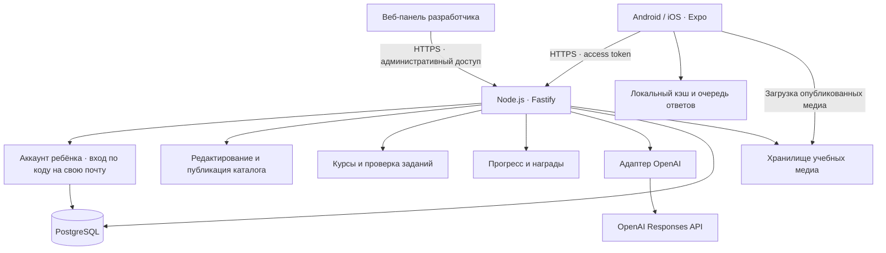

# Архитектура «ЛингвоГероя»

Дата: 18 сентября 2026. Концепция аккаунтов обновлена 19 сентября 2026. Статус: проект архитектуры для поэтапной реализации.

Состояние реализации: workspace, Expo-приложение, три типа заданий, пять уроков, повторение ошибок, версии пакетов и сохранение через AsyncStorage. API отдаёт каталог, уроки и медиа; публикация выполняется локальной командой с проверкой файлов и неизменяемости версий. Файловый каталог — временное хранилище до БД и панели. Контракт текущего этапа описан в [CONTENT.md](CONTENT.md). Остальные разделы описывают целевую систему; наличие здесь API-маршрута или сущности не означает, что они уже реализованы. Актуальный статус — в [плане](ROADMAP.md), запуск — в [README](../README.md).

## 1. Исходные решения

Подтверждено пользователем: аудитория 6–9 лет; мобильное приложение Android/iOS; игровой формат; английский первым, другие языки позже; интеграция с OpenAI API; ключ через `.env`; дизайн из `../stitch_`.

Дополнительное требование: отдельная веб-панель разработчика для управления заданиями и доступными языками. Новые языки и задания должны публиковаться как серверный контент без обновления мобильного приложения. Панель входит в план первой версии до массового наполнения курса.

Офлайн-режим также входит в первую версию: автоматическая предзагрузка трёх следующих уроков, явный сигнал о потере связи, прохождение загруженных уроков без сети и синхронизация результатов после подключения. Текущий урок сохраняется отдельно и не входит в число трёх следующих.

Подтверждённая концепция аккаунтов: один ребёнок — один аккаунт со своей почтой. Родитель не участвует в приложении; семейные аккаунты, несколько детских профилей в одном аккаунте и родительские функции не предусмотрены. Профиль — данные самого ребёнка в его аккаунте.

Предлагаемые продуктовые допущения: русский интерфейс и язык объяснений; начальный уровень английского; занятия по 5–10 минут. Это рабочие решения, которые можно изменить независимо от игрового движка.

Рабочее название — «ЛингвоГерой», персонаж — лисёнок Тим. Игровой цикл: **карта → короткий урок → обратная связь → награда → повторение слов → следующий урок**.

Первая версия содержит карту, три типа упражнений, озвучку учебных слов, прогресс, звёзды/XP/монеты, базовый гардероб, профиль и настройки аккаунта. ИИ помогает готовить учебный контент и объяснения. Детский интерфейс использует выбор готовых ответов; свободный чат и запись голоса относятся к дальнейшим этапам.

## 2. Материалы и визуальная основа

Прочитаны `DESIGN.md` и HTML всех семи экранов; визуально просмотрены карта, урок и логотип.

| Материал в `../stitch_` | Назначение | Использование |
| --- | --- | --- |
| `playful_tactile_wonder/DESIGN.md` | Палитра, типографика, размеры, состояния | Основа общей темы и компонентов |
| `_1` | Карта мира и уровней | Главный экран |
| `_2` | Магазин и примерка на Тима | Базовый гардероб после учебного цикла |
| `_3` | Урок «послушай и выбери» | Первый реализуемый урок |
| `_4`, `_5` | Варианты колеса наград | Отдельное последующее расширение |
| `_6` | Исходный макет профиля | Профиль ребёнка, его статистика и настройки аккаунта; родительская зона из макета не используется |
| `_7` | Квесты, трофеи и награды | Экран наград; квесты позже |
| `logo/screen.png` | Лисёнок в наушниках | Исходный образ персонажа и бренда |

HTML служит визуальным референсом; экраны реализуются нативными компонентами React Native. Данные и обработчики из макетов заменяются реальной логикой.

В дизайн-системе расходятся машинные токены и текстовое описание некоторых цветов. За базу берём токены и вид существующих экранов: фон `#F8F9FF`, действие `#22C55E`, награды `#FEA619`, аудио `#36B6FB`; отдельные акценты описываем явно. Заголовки — Rubik, основной текст — Nunito Sans. Шрифты включаем в сборку с проверенной лицензией.

Общие компоненты: `ToyButton`, `ResourceBadge`, `ProgressBar`, `LevelNode`, `WordCard`, `AudioButton`, `Mascot`, `RewardSheet`. Сенсорные цели от 56×56, адаптация к safe area и размеру текста, подпись вместе с цветовым сигналом, отключение звука/вибрации и уменьшение анимаций. На узком экране HUD сокращается и перестраивается: в предоставленных скриншотах видна обрезка правого края.

Состояния маскота: приветствие, ожидание, подсказка, поддержка при ошибке, радость. Ошибка даёт попытку и объяснение. Предлагаем не блокировать обучение из-за исчерпания сердечек; изменение этой механики относительно макетов отмечено как продуктовое предложение.

Иллюстрации животных в макетах местами содержат элементы чужого интерфейса внутри картинки. Для продукта подготовим отдельные чистые изображения в едином стиле. Растровые иллюстрации и варианты Тима генерируем либо подбираем с разрешённым использованием; простые значки и карту рисуем в SVG. Текст хранится отдельно от изображений. У каждого ассета — стабильный ID, источник/лицензия или описание генерации, версия, размеры и альтернативный текст. Временные внешние URL из HTML не становятся зависимостью приложения.

## 3. Общая схема

Один репозиторий, мобильное приложение, веб-панель разработчика и один модульный сервер. Это позволяет развивать продукт без раннего разделения на микросервисы.



Мобильное приложение отвечает за игру, аудио, анимации, локальную проверку ответов и устойчивое хранение офлайн-результатов. Веб-панель отвечает за редактирование и предпросмотр контента. Сервер отвечает за доступ к данным, публикацию каталога, состав урока, окончательную проверку, прогресс, экономику и вызовы ИИ. База — источник подтверждённого прогресса и опубликованного каталога. Локальные пакеты и очередь событий позволяют проходить скачанные уроки без сети; результаты ожидают подтверждения сервером.

## 4. Технологии

| Область | Предлагаемый выбор | Причина |
| --- | --- | --- |
| Мобильное приложение | React Native, Expo, TypeScript | Общая основа Android/iOS, нативные экраны |
| Веб-панель разработчика | React, TypeScript, общий API и схемы контента | Управление языками и заданиями через браузер |
| Навигация | Expo Router | Единая структура экранов и переходов |
| UI | React Native StyleSheet, токены темы, SVG | Прямой контроль над тактильным дизайном |
| Анимации | React Native Reanimated | Нажатия, движение персонажа, награды |
| Состояние | TanStack Query + reducer текущего урока | Разделение данных сервера и игрового состояния |
| Локальное хранение | Expo SQLite; SecureStore для сессии | Очередь ответов, кэш, защищённое хранение токенов |
| Аудио | Expo Audio | Проигрывание подготовленных слов и фраз |
| API | Node.js LTS, Fastify, TypeScript | Небольшой сервер с модулями по функциям |
| Контракты | Zod и OpenAPI | Проверка запросов/ответов и явный контракт |
| База | PostgreSQL + Prisma | Связи, транзакции и миграции |
| Вход ребёнка | Собственный API аккаунтов, код на email | Один аккаунт на ребёнка, беспарольный вход по собственной почте |
| Медиа | Файлы сборки в прототипе, объектное хранилище/CDN далее | Быстрый старт и версионируемые загрузки |
| OpenAI | Официальный серверный SDK, Responses API | Изолированная интеграция с проверяемым форматом ответа |
| Сборки | EAS Build | Облачные сборки для двух платформ |

Это архитектурный выбор, а не уже установленные зависимости. Совместимые версии Expo и нативных библиотек фиксируем lock-файлом при создании каркаса.

Expo Router поддерживает общую структуру навигации Android/iOS. Локальный симулятор iOS требует macOS/Xcode; для работы из текущего Windows-окружения планируем Android-эмулятор и проверку iOS на устройстве через облачные сборки. [Expo Router](https://docs.expo.dev/router/introduction/), [EAS Build](https://docs.expo.dev/build/introduction/).

Вход реализован через `/v1/account`: ребёнок получает одноразовый код на собственную почту, сервер проверяет его и выдаёт сессию. Для браузера используется HttpOnly cookie, для нативного приложения — токен в SecureStore. Supabase для входа не используется. Для Node.js предлагаем Fastify с отдельными модулями. [Fastify](https://fastify.dev/docs/latest/).

## 5. Структура репозитория

Целевая структура; на первом этапе созданы `apps/mobile`, `apps/api`, описание будущего `apps/admin`, `packages/contracts` и `packages/learning-core`. Отдельные будущие модули и база данных пока не реализованы.

```text
apps/
  mobile/
    app/                  # Группы маршрутов onboarding, tabs, lesson, account
    src/
      features/           # map, lesson, rewards, wardrobe, profile, account
      components/         # Общие игровые компоненты
      theme/              # Цвета, шрифты, размеры, анимации
      services/           # API, аудио, авторизация, предзагрузка, сеть, синхронизация
      storage/            # Пакеты уроков, локальные сессии, очередь событий
    assets/               # Начальный комплект иллюстраций, звуков и шрифтов
    .env.example          # Только публичные настройки
  admin/
    src/
      features/           # languages, courses, exercises, media, publishing
      components/         # Формы редактора и предпросмотр
      services/           # API-клиент и административная сессия
    .env.example          # Публичный адрес API; без серверных секретов
  api/
    src/
      modules/            # auth, accounts, curriculum, sessions, rewards, ai, admin
      infrastructure/     # DB, auth provider, OpenAI, media, telemetry
      config/             # Проверка env при запуске
    prisma/               # Схема и миграции
    .env.example          # Имена серверных переменных без значений секретов
packages/
  contracts/              # Схемы запросов/ответов, типы упражнений
  learning-core/          # Чистые правила проверки и учебного прогресса
  content-schema/         # Схемы языковых пакетов и публикации
content/
  en/                     # Начальный импорт и экспорт курса английского
  locales/ru/             # Русские тексты интерфейса
  assets-manifest/        # Происхождение, версии и ID медиа
docs/
  ARCHITECTURE.md
  ROADMAP.md
```

Пакеты объединяем через pnpm workspaces. `contracts` не импортирует серверные SDK. `learning-core` не зависит от React Native, БД или OpenAI и используется для одинаковой проверки онлайн и офлайн. Полный каталог ответов не включается в сборку; данные локальной проверки приходят только в разрешённых пакетах скачиваемых уроков. Сервер повторно проверяет результаты по своей закреплённой версии.

После ввода веб-панели источником актуального контента становится БД. Файлы `content/` остаются для демонстрационного комплекта, начального импорта и экспорта; изменение файлов и пересборка не нужны для повседневного наполнения. Импорт проходит ту же валидацию и создаёт черновики, сохраняя единый процесс публикации.

## 6. Экраны и модули

Основная навигация: **Карта / Награды / Профиль**. Урок открывается отдельным полноэкранным маршрутом с подтверждением выхода и сохранением позиции. Кнопку входа в текущий урок размещаем на карте; отдельную вкладку «Урок» из макета можно вернуть без изменений доменной логики.

| Модуль | Ответственность |
| --- | --- |
| Вход и аккаунт | Аккаунт ребёнка, собственная почта, профиль и настройки |
| Каталог | Доступные языки, курсы, темы и опубликованные версии |
| Веб-панель и публикация | Управление языками/заданиями, медиа, предпросмотр, версии и аудит изменений |
| Карта | Открытые уровни, следующий шаг, повторение |
| Движок урока | Последовательность упражнений, попытки, аудио, подсказки |
| Офлайн и синхронизация | Текущий и три следующих урока, состояние сети, локальные ответы и повторная отправка |
| Проверка | Оценка ответа по правилам типа задания |
| Прогресс | Навыки, освоенные слова, завершённые уроки, повторение |
| Награды | XP, звёзды, монеты и журнал начислений |
| Гардероб | Каталог предметов, покупка за игровые монеты, надетый образ |
| ИИ | Подготовка черновиков контента и ограниченные объяснения |
| Настройки аккаунта | Настройки ребёнка, смена почты, восстановление доступа и удаление своего аккаунта |

Колесо, несколько валют, лиги, внешние отчёты, уведомления и усложнённые квесты остаются расширениями. Для первой учебной версии предлагаем XP, звёзды и одну игровую валюту; магазин содержит косметические предметы за заработанные монеты.

## 7. Учебная модель и расширение языков

Разделяем `uiLocale` — язык интерфейса, `nativeLanguage` — язык объяснений, `targetLanguage` — изучаемый язык. Первые значения: `ru`, `ru`, `en`. Локаль озвучки задаётся отдельно, например `en-GB`.

Структура курса: **язык → курс → тема/мир → урок → упражнения → учебные элементы**. Пример: `en → beginner → animals → forest-01 → listen-and-select`.

Три типа упражнений MVP:

1. `listen-and-select`: прослушать слово/фразу и выбрать изображение.
2. `image-and-select`: выбрать слово к изображению.
3. `match-pairs`: собрать пары слово/изображение или слово/перевод.

Следующие типы — `word-order`, короткий ввод и произношение — подключаются через реестр типов. Каждый тип имеет схему данных, компонент отображения, правила проверки и доступные подсказки. Состояния урока: `loading → answering → checking → feedback → next → completed`. Состояния связи и синхронизации ведутся отдельно: отсутствие сети не прерывает этот цикл у полностью скачанного урока. Обязательные упражнения MVP поддерживают локальную проверку.

Языковой пакет содержит код языка, направление письма, учебные элементы, локализованные объяснения, варианты озвучки, порядок тем, поддерживаемые типы упражнений и правила нормализации ответов. ID слов и уроков стабильны; переводы не используются как ключи.

Добавление языка выполняется через веб-панель и включает контент, аудио, проверку лингвистических правил и тесты курса. Коды языков — данные каталога, а не фиксированный enum в приложении. Названия, направление письма, оформление курса и ссылки на медиа приходят с сервера. Общая карта, награды и профили переиспользуются. Для существующих типов заданий новые языки и уроки не требуют мобильного релиза. Новое взаимодействие или неподдерживаемая возможность отображения могут потребовать расширения движка и обновления приложения; правила совместимости описаны в разделе 15.

Начальный комплект предлагаем ограничить темами Animals, Colors, Numbers, Family и Food. Объём каждого мира уточняется при подготовке контента; первый сквозной пример — Animals на 6–8 упражнений.

Повторение в MVP — прозрачное правило по результатам, например возврат ошибочных слов в конце урока и очереди на следующие дни. Конкретные интервалы и пороги вынесены в версионируемые настройки. XP не равен освоению: статус слова зависит от самостоятельных ответов в нескольких занятиях.

## 8. Модель данных

| Сущность | Основные данные |
| --- | --- |
| `LearnerAccount` | ID ребёнка, собственная почта, данные восстановления доступа |
| `AccountProfile` | Профиль единственного владельца аккаунта: псевдоним, аватар, язык, образ |
| `Language` | Код, названия, направление письма, локали озвучки, порядок и доступность |
| `Course`, `Unit` | Язык, последовательность тем, условия доступа |
| `CatalogRelease` | Ревизия каталога, ссылки на версии уроков и языков, схема и требования к клиенту |
| `LessonVersion`, `Exercise` | Неизменяемая опубликованная версия, тип, payload, серверный ключ ответа |
| `LearningItem` | Слово/фраза, смысл, переводы, ссылки на медиа |
| `LessonSession` | Ребёнок, версия урока, порядок упражнений, состояние |
| `OfflineGrant` | Выданный сервером допуск к пакетам профиля/курса, версии и условия последовательного открытия |
| `LocalLessonPackage` | На устройстве: версия урока/правил, файлы и контрольные суммы, состояние загрузки |
| `SyncEvent` | На устройстве: стабильный ID события/сессии, порядковый номер, payload, статус подтверждения |
| `AnswerAttempt` | Сессия, упражнение, попытка, ответ, результат, ключ повтора запроса |
| `LearningProgress` | Ребёнок + учебный элемент, освоение, срок повторения |
| `LessonCompletion` | Итог, звёзды, дата и версия правил |
| `RewardLedger` | Получатель, источник, тип награды, изменение баланса |
| `InventoryItem`, `Equipment` | Приобретённые и надетые предметы |
| `AccountSettings` | Настройки собственного аккаунта; отдельной родительской роли нет |
| `ContentDraft`, `Asset` | Черновик/публикация, происхождение и версии материалов |
| `AdminRole`, `ContentAuditLog` | Административные права, автор, действие, время и изменённая версия |

Отдельная сущность языка позволяет добавлять курсы без изменения профиля. Прогресс хранится по языку/курсу, гардероб принадлежит профилю в целом. Точная дата рождения, фото и настоящее имя для игровой логики не нужны.

Правила целостности:

- Сессия фиксирует версию урока; публикация обновлений не меняет уже начатый урок.
- Сервер проверяет принадлежность профиля, прогресса и каждой сессии текущему аккаунту ребёнка; создавать дополнительные профили внутри аккаунта нельзя.
- Повторный запрос с тем же ключом и телом возвращает прежний результат; с другим телом отклоняется. Проверка и сохранение результата атомарны.
- Начисление награды и завершение сессии проходят в одной транзакции. Уникальность источника в `RewardLedger` исключает повторное получение.
- Баланс нельзя сделать отрицательным: покупка проверяет остаток и списывает его атомарно. Уникальность предмета защищает от повторной покупки.
- Для первой версии награда за урок начисляется один раз; повторение даёт учебный прогресс. Изменение звёзд при повторе не повторяет первоначальное начисление.
- При синхронизации с нескольких устройств уникальность первой награды определяется профилем и стабильным ID урока, а не только сессией. Офлайн-попытки объединяются как события, не заменяют прогресс целым локальным снимком.
- Дневные счётчики опираются на серверное время и сохранённый часовой пояс. Отправленная клиентом дата сама по себе не создаёт награду.

## 9. Контракты API

Версионированный REST `/v1`. Во всех защищённых операциях сервер проверяет токен, принадлежность данных и входную схему. Идентификатор ребёнка в URL не является подтверждением доступа.

| Метод и маршрут | Назначение |
| --- | --- |
| `GET /v1/catalog/languages` | Опубликованные доступные языки, совместимые с клиентом |
| `GET /v1/catalog/manifest` | Ревизия каталога, версии курсов, совместимость и ссылки на медиа |
| `GET /v1/catalog/courses/:id` | Опубликованная структура курса для поддерживаемых возможностей клиента |
| `POST /v1/account/auth/code`, `POST /v1/account/auth/verify` | Вход ребёнка по коду на собственную почту; создание аккаунта при первом входе |
| `GET /v1/account/me`, `PATCH /v1/account/me` | Получить и изменить собственный профиль |
| `GET /v1/account/map?courseId=...` | Карта и состояние уровней |
| `POST /v1/account/sessions` | Создать сессию опубликованного урока |
| `POST /v1/account/offline-window` | Получить/обновить допуск и пакеты текущего и трёх следующих уроков активного курса |
| `POST /v1/account/sync` | Синхронизировать локальные сессии, ответы и завершения с подтверждением каждого события |
| `GET /v1/sessions/:id` | Восстановить сессию |
| `POST /v1/sessions/:id/answers` | Проверить и сохранить ответ |
| `POST /v1/sessions/:id/complete` | Проверить завершение и начислить награду |
| `POST /v1/sessions/:id/hints` | Получить допустимую подсказку |
| `GET /v1/account/progress` | Учебная статистика |
| `GET /v1/account/rewards` | Балансы, достижения и гардероб |
| `POST /v1/account/purchases` | Купить предмет за игровую валюту |
| `PUT /v1/account/equipment` | Сохранить образ Тима |
| `POST /v1/account/email` | Сменить собственную почту с подтверждением |
| `POST /v1/account/delete` | Удалить собственный аккаунт и связанные данные с подтверждением |

При создании сессии передаются `lessonId` и `contentVersion`. Ответ на упражнение содержит `exerciseId`, `attemptId` и типизированный `answer`. XP, правильность и размер награды от клиента не принимаются. `Idempotency-Key` обязателен для создания сессии, ответов, завершения и покупки.

Офлайн-сессия создаётся на устройстве со стабильным UUID и ссылкой на `OfflineGrant` без сетевого вызова. Синхронизация передаёт допуск, версию пакета, ID сессии и события с `eventId`/порядком; сервер создаёт её запись и проверяет разрешённость урока. Получение окна идемпотентно; отправка пачки событий безопасно повторяется по ID каждого события. Для онлайн-запроса и его офлайн-повтора используются те же ID, в том числе при потере ответа уже выполнившего запрос сервера.

Ответ API: полезные данные либо ошибка с `code`, `messageKey`, `retryable`, `requestId`. Таймаут повторяется с тем же ключом; бизнес-ошибки автоматически не повторяются. Смена почты и удаление аккаунта требуют подтверждения на сервере, а не только флага в интерфейсе.

Административные маршруты находятся под `/v1/admin`: создание/редактирование языков, курсов и черновиков упражнений, загрузка медиа, предпросмотр, валидация, публикация, отключение и откат каталога. Доступ проверяется сервером по административной роли; сессия ребёнка его не предоставляет. Изменения черновика требуют ожидаемой ревизии (`If-Match`), чтобы не затереть чужую правку. Публикация и откат идемпотентны. Детский каталог исключает черновики, ключи ответов и административные поля; отдельный авторизованный офлайн-пакет содержит необходимые данные локальной проверки только для разрешённых уроков.

## 10. OpenAI: назначение и границы

Используем OpenAI API через серверный адаптер `AiService`. Идентификатор модели задаётся в `OPENAI_MODEL`; модель выбираем на этапе интеграции по доступности, качеству русского/английского, задержке и цене. Клиент не задаёт модель, системный промпт или доступные инструменты.

Responses API со Structured Outputs позволяет задать JSON Schema ответа. Схема контролирует форму, поэтому отдельно проверяем учебную корректность и допустимость содержания; отказ модели и незавершённый ответ обрабатываем отдельно. [Structured Outputs](https://developers.openai.com/api/docs/guides/structured-outputs).

Два сценария:

1. **Подготовка контента.** Разработчик запускает генерацию для заданной темы и словаря. Ответ проходит схемную и смысловую проверку и сохраняется черновиком. После просмотра публикуется версия курса. Это основной путь появления новых заданий и объяснений в MVP.
2. **Помощь в уроке.** Ребёнок нажимает «Помоги». Сервер выбирает готовую проверенную подсказку. Ограниченную генерацию дополнительного объяснения можно включить флагом после оценки качества. Модель получает только общие учебные данные; награды и окончательная оценка ответа от неё не зависят.

Предлагаемый контракт объяснения: `explanation`, `example`, `encouragement`. Ограничения: короткие предложения, утверждённый словарь, отсутствие внешних ссылок, HTML и инструкций к действиям вне урока. Текст рисуется как обычный текст. Потоковый показ до проверки не используем.

Пайплайн: разрешённая операция → лимит бюджета → подготовленный учебный контекст → OpenAI → проверка схемы/лексики/длины и содержания → ответ либо готовая подсказка. Для динамического текста предусматриваем модерацию; она не заменяет проверку педагогической корректности. В ранней версии допускается полностью отключить динамические объяснения, сохранив OpenAI для подготовки курса.

Кэш общих объяснений зависит от языка, упражнения, версии промпта и модели. Ограничиваем параллельные вызовы, длину ответа, суточный бюджет и число запросов на аккаунт. Начальные настройки: таймаут 8 секунд, максимум одна повторная попытка в пределах общего времени; после отказа или исчерпания бюджета — проверенный локальный текст. Значения уточняем измерениями.

Приложение для детей до 13 лет требует особого внимания к данным: официальное руководство OpenAI указывает на необходимость Zero Data Retention перед обработкой персональных данных детей этого возраста. Поэтому в MVP в OpenAI отправляется общий учебный контекст без имени, email, идентификатора ребёнка, истории его занятий, голоса или свободного ввода. Это конструктивное ограничение payload, а не попытка заменить требования согласием родителя. [Under-18 guidance](https://developers.openai.com/api/docs/guides/safety-checks/under-18-api-guidance).

`store: false` не равен включённому Zero Data Retention; доступность ZDR и условия выбранной модели/эндпоинта проверяются отдельно перед появлением функций с персональными данными. [Управление данными OpenAI](https://developers.openai.com/api/docs/guides/your-data). Голосовой ввод и свободный разговор не входят в MVP.

## 11. Ключи, аккаунты и данные

Предлагаемые серверные переменные в `apps/api/.env`: `OPENAI_API_KEY`, `OPENAI_MODEL`, `DATABASE_URL`, `AUTH_ISSUER`, `AUTH_AUDIENCE`. Файл загружается только сервером; при запуске валидируется конфигурация. В production секреты задаются средствами хостинга.

Мобильная переменная: `EXPO_PUBLIC_API_URL`. Вход выполняется через наш API аккаунтов; ключ внешнего провайдера авторизации не нужен. OpenAI, ключи администрирования и пароль БД не попадают в приложение, `app.config`, медиа, логи или EAS-артефакты. Переменные `EXPO_PUBLIC_*` доступны в собранном приложении. [Переменные окружения Expo](https://docs.expo.dev/guides/environment-variables/).

На этапе каркаса добавляем `.gitignore` для `.env` и вариантов, а в репозиторий — только `.env.example` без секретов. На этапе архитектуры вводить ключ пока не требуется.

Ребёнок входит кодом из своей почты; сервер проверяет срок действия кода, число попыток и одноразовость подтверждения. У аккаунта один профиль, выбора семьи или детских профилей нет. Нативный токен хранится в SecureStore, браузерная сессия — в HttpOnly cookie; сервер проверяет срок и отзыв сессии. При первом входе выдаётся резервный код восстановления. Смена почты и удаление аккаунта требуют подтверждения на сервере. Родительская зона, PIN родителя и проверка «7 + 5» из макета не входят в продукт.

В логах — технический ID запроса, длительность, код ошибки и расход API. Без ключей, токенов, email и сырого текста детских данных. Очистка профиля включает БД, локальный кэш и связанные файлы; для резервных копий задаётся срок истечения и процедура предотвращения восстановления удалённых профилей. Конкретные сроки и требования регионов определим до внешнего тестирования.

## 12. Офлайн-режим, предзагрузка и синхронизация

### Предзагрузка

Офлайн-режим обязателен для MVP. При наличии связи приложение автоматически сохраняет **текущий урок и три следующих** по маршруту активного профиля и курса. Если текущий урок ещё не начат, это ближайший доступный урок плюс три после него. В конце курса загружаются все оставшиеся. Если опубликованного контента меньше, показываем фактическое число готовых уроков. После завершения урока, выбора курса, возврата в приложение и восстановления связи окно пополняется; работу в фоне при закрытом приложении не считаем гарантированной.

Будущие уроки скачиваются заранее, даже если они пока закрыты условием завершения предыдущего. Сервер выдаёт `OfflineGrant`, связанный с профилем, курсом, версиями пакетов и правилами открытия. Эти правила проверяются локально при прохождении цепочки и повторно сервером при синхронизации. Скачивание не разблокирует произвольные уровни.

Пакет содержит задания, порядок/параметры сессии, данные локальной проверки, готовые подсказки, версию правил, изображения, аудио и необходимые шрифты. Сначала загружается текущий урок, затем следующие по порядку. Пакет получает состояние `ready` только после проверки схемы, совместимости и всех обязательных файлов по контрольным суммам. Прерванная загрузка возобновляется; неполный пакет не предлагается как доступный офлайн. Онлайн-урок запускается после подготовки его полного пакета, чтобы потеря связи посреди занятия не мешала продолжить.

На устройстве сохраняются текущий урок, три следующих и материалы с несинхронизированными результатами; их автоматическая очистка запрещена. Остальные старые пакеты очищаются по давности использования в пределах лимита диска. Пакеты разделяются по профилям/курсам, общие медиа переиспользуются по хешу. При смене курса сохраняем незавершённые сессии и результаты предыдущего. Если места недостаточно, сообщаем «Скачано 2 из 3 уроков» и предлагаем освободить место на устройстве; готовые уроки остаются доступны.

### Поведение при потере связи

При переходе в офлайн показываем ненавязчивый баннер: **«Нет связи. Можно заниматься в скачанных уроках — успехи сохраним на устройстве»**. Индикатор состояния остаётся видимым; повторяющиеся модальные окна не прерывают ребёнка. На карте есть отметки «Доступно без интернета» и «Нужно скачать». Отслеживаем доступность нашего API, а не только подключение к Wi-Fi: таймауты сервера также переводят урок в автономное выполнение. Состояния — подключено, офлайн, синхронизация, требуется вход; текст различает отсутствие интернета и временную недоступность сервера.

Ребёнок может закончить текущий урок, пройти три следующих по мере открытия и повторять уже скачанные. Ответ проверяется локально, позиция и событие ответа записываются в SQLite одной транзакцией до показа результата. Продолжение не ждёт сервер. Доступны озвучка, готовые подсказки, обычный экран завершения и предварительный учебный прогресс. Рядом с результатом — «Сохранено на устройстве». Онлайн-подсказка заменяется готовой; новые вызовы ИИ не нужны для завершения ни одного обязательного задания.

После исчерпания скачанных новых уроков предлагаем повторение сохранённых; новые материалы потребуют подключения. Если пользователь ещё ничего не скачал, доступен встроенный демонстрационный урок без привязки к реальному прогрессу и объяснение, что для загрузки курса нужна сеть. Перезапуск приложения сохраняет доступ к локальному профилю, урокам и очереди. Истёкший токен не блокирует скачанные занятия; для отправки результатов понадобится восстановить авторизацию. Первичный вход и загрузка нового профиля требуют подключения.

Звёзды/XP показываются как предварительные до синхронизации. Баланс монет для покупок меняется после подтверждения сервером; покупка требует связи. Это позволяет закончить занятие с наградным экраном без риска двойного расходования монет.

### Синхронизация результатов

Локальная очередь хранит создание сессии, попытки и завершение со стабильными ID и последовательностью. После восстановления доступа к API и авторизации приложение отправляет её по порядку: сначала зависимости и предыдущий урок, затем следующий. Повторные попытки используют задержку и те же ID. Сервер подтверждает каждое событие отдельно; клиент удаляет из очереди только подтверждённые события. Потеря ответа или частичный успех пачки не теряют результаты и не создают повторных наград.

Сервер проверяет принадлежность профиля, допуск, версию пакета, состав упражнений, ответы и условия открытия, затем пересчитывает прогресс и награды транзакционно. Подпись/серверная запись допуска и контрольные суммы определяют разрешённый пакет, но не доказывают честность ответов: локальные ключи проверки доступны владельцу устройства. Это принимаемый компромисс учебного офлайн-режима. Клиентские XP и время не считаются достоверными; в MVP дневные награды учитываются по серверной дате подтверждения, локальная дата остаётся информацией о занятии.

При работе на двух устройствах события объединяются, а первая награда за один урок выдаётся только один раз на профиль. После подтверждения локальный прогресс сверяется с сервером, показывается «Все успехи сохранены», затем запас пополняется. Ошибки доступа/версии сохраняются отдельно с понятным статусом; такие события не повторяются бесконечно. Удалённый профиль не воссоздаётся из офлайн-очереди.

Новые публикации не меняют уже выданный пакет: его версии сохраняются на сервере для пересчёта офлайн-результатов. Обычное архивирование/отключение прекращает выдачу новых допусков, но ранее выданные сохраняют право синхронизировать разрешённые уроки. После получения свежего каталога новые локальные старты отключённого курса прекращаются. Явный критический отзыв отменяет допуск; локальный результат сохраняется как история практики с объяснением, серверная награда за отозванный контент не начисляется. До восстановления связи устройство не может узнать об отзыве.

### Медиа

Озвучка — подготовленные и проверенные файлы слов/фраз с версией, контрольной суммой и локалью голоса. Нажатие воспроизведения не вызывает API. Ошибка аудио предлагает повторную загрузку при появлении сети; неполный урок не засчитывается по отсутствующему звуку. Другие полностью скачанные уроки остаются доступны. Будущая синтезированная озвучка также готовится и сохраняется заранее.

## 13. Развёртывание и проверка

Разделяем development, staging и production: отдельные базы, ключи и проекты авторизации. Первый сервер — один контейнер Node.js, управляемый PostgreSQL и объектное хранилище. Конкретный хостинг выбираем перед внешней тестовой сборкой с учётом региона и бюджета. Миграции выполняются отдельным шагом; резервное копирование проверяется восстановлением. Redis и отдельная очередь задач понадобятся только при измеренной нагрузке или массовой подготовке медиа.

Веб-панель развёртывается отдельно как веб-приложение и обращается к тому же серверу по административным маршрутам. Обновление контента не требует развёртывания панели, сервера или мобильного кода; публикация переключает выпуск каталога в БД.

Минимальная проверка реализации:

- Unit: оценка ответов, освоение, открытие уровней и расчёт наград.
- Integration: чужой профиль недоступен; повтор/конкуренция запросов не удваивает награды; покупка не создаёт отрицательный баланс; старая сессия переживает публикацию нового курса.
- Mobile: карта → урок → результат; повторное открытие приложения; ошибка и восстановление сети; отсутствие звука; крупный текст; маленький Android и iPhone.
- Offline: текущий и три следующих урока полностью проходят в авиарежиме, включая звук и последовательное открытие; после перезапуска доступны результаты и повторение. Проверены отсутствие пакетов, конец курса, смена профиля, нехватка места, частичная загрузка, истёкший токен и недоступный API при рабочем Wi-Fi.
- Sync: обрыв после принятого ответа, частичное подтверждение пачки, два устройства, обычная публикация/архивирование и критический отзыв во время отсутствия связи; без потери подтверждённых ответов и удвоения наград.
- Content: язык и урок, созданные в веб-панели, появляются в той же установленной сборке Android/iOS; проверены скрытие черновиков, отключение, откат, несовместимый тип задания, неполная загрузка медиа и сохранение активной сессии на прежней версии.
- Admin: аккаунт ребёнка не может изменять контент; конкурирующие правки обнаруживаются; неполный курс не публикуется; история изменений фиксирует автора и версию.
- AI: корректный JSON, отказ, таймаут, неполный ответ, неподходящее объяснение; во всех случаях доступна готовая подсказка. Проверка исходящего payload на отсутствие персональных данных.
- Release: отсутствие секретов в мобильной сборке; реальные Android/iOS-сборки; смена почты и удаление аккаунта только после подтверждения.

Измеряем завершение уроков, места затруднений, ошибки аудио, задержку ответа сервера, частоту резервных подсказок и расход OpenAI. Используем минимально необходимые агрегаты. Объём контента, качество обучения и удобство проверяем короткими занятиями с детьми перед расширением механик.

## 14. Что уточняется по мере реализации

Возраст и платформы уже определены. Один аккаунт на ребёнка с собственной почтой — подтверждённое решение. Русский интерфейс, длительность урока, одна валюта и упрощённые механики наград — предложенные настройки первой версии. Выбор модели OpenAI, инфраструктуры, объёма курса и порядка следующих языков остаётся открытым до соответствующего этапа и не мешает создать каркас.

Первый демонстрационный путь Animals реализован: карта, урок на слух, обратная связь и экран награды. Дальнейшее развитие учебного движка, серверного прогресса, панели и офлайн-пакетов — в [плане реализации](ROADMAP.md).

## 15. Веб-панель разработчика и контент без обновления приложения

Веб-панель — отдельный рабочий интерфейс разработчика/редактора. Она содержит разделы **Языки → Курсы → Темы → Уроки → Задания**, медиатеку и историю публикаций. Разработчик может добавлять, редактировать, копировать, менять порядок, публиковать и архивировать материалы. Для языка отдельно задаётся доступность в мобильном каталоге. Удаление неопубликованного черновика допустимо; использованные в занятиях версии архивируются с сохранением связей с прогрессом.

Редактор задания содержит тип, текст инструкции, учебные слова, варианты и правильные ответы, подсказки, изображения и аудио. Правила отображаются понятными полями формы; ручное редактирование JSON не требуется. Предусмотрены предпросмотр задания и последовательности урока, а также поиск/фильтры по языку, теме, типу и статусу. На этапе интеграции ИИ добавляется кнопка генерации черновика по выбранным словам и теме с дальнейшим ручным редактированием.

Процесс: **черновик → проверка → готово к публикации → опубликованная версия → архив**. Любая правка проверенного черновика сбрасывает готовность. Предпросмотр черновиков доступен только редактору и не меняет детский прогресс. Сервер проверяет схемы, наличие правильных ответов, медиа, доступность шрифтов для письма, связи уроков, выполнимость условий открытия и совместимость. Для обязательных уроков MVP дополнительно проверяются полнота офлайн-пакета, локальная проверка ответов и готовые подсказки. Панель показывает размер пакета и недостающие файлы. Язык появляется в каталоге только после включения и публикации хотя бы одного доступного курса с начальным уроком.

Публикация создаёт неизменяемые версии уроков и выпуск каталога, затем атомарно переключает текущую ревизию. Медиа загружаются и проверяются до переключения. Частичная загрузка не становится доступна детям. Возврат к предыдущему выпуску создаёт новую ревизию каталога со ссылками на прежний контент, чтобы клиенты корректно обнаружили изменение. Журнал хранит автора, действие, дату и версии; одновременные правки не перезаписываются молча.

Протокол доставки контента:

1. При запуске, возврате приложения на передний план и ручном обновлении списка клиент проверяет каталог через `ETag`/ревизию; частые проверки объединяются. Без сети остаётся последняя полностью полученная версия.
2. Клиент сообщает `contentSchemaVersion` и поддерживаемые типы/версии упражнений. Манифест содержит `catalogRevision`, языки, версии курсов, требования к возможностям клиента и ссылки/контрольные суммы медиа. Ключей ответов в нём нет.
3. Сервер отдаёт только совместимые опубликованные курсы. Если обязательный урок использует неизвестную механику, весь соответствующий путь скрывается от этого клиента, чтобы карта не приводила в тупик. Панель показывает, каким версиям клиента доступен выпуск.
4. Приложение получает структуру курса и необходимые медиа, проверяет загрузку и атомарно обновляет локальный кэш. Новые офлайн-пакеты используют новый выпуск; текущая сессия и ранее выданные допуски сохраняют закреплённые версии для завершения и синхронизации. Получение свежего каталога не меняет экран задания посреди ответа; запас из трёх следующих уроков обновляется отдельно.
5. Отключённый язык или архивный урок исключается из нового выбора и выдачи допусков. Уже начатую сессию разрешаем завершить, сохранённый прогресс остаётся. Результаты уроков, пройденных по ранее выданному офлайн-допуску, принимаются по правилам раздела 12. Для критически ошибочного контента предусмотрен явный отзыв версии: сервер прекращает её использование, клиент после связи предлагает актуальные уроки с сохранением ранее подтверждённого прогресса. Мгновенный отзыв на устройстве без сети невозможен.

Кэш хранит ревизию каталога отдельно от прогресса. Стабильные ID связывают результаты с уроками и учебными элементами независимо от переименования или перестановки. Обновление каталога не обнуляет достижения; удаление ранее использованных ID не допускается.

**Граница требования:** добавление языков, слов, уроков, вариантов ответов, картинок и озвучки в поддерживаемых типах упражнений выполняется через данные, без обновления приложения и без загрузки исполняемого кода. Поддержка направления письма и отображения языковых символов закладывается в компоненты; требования к шрифтам проверяются при публикации. Новый тип упражнения или новая нативная функция требует реализации в движке и может потребовать мобильного релиза. Такие изменения панель явно отличает от обычного пополнения курса.

Критерий приёмки: на неизменённой установленной сборке сначала доступен английский, затем после публикации через веб-панель и обновления каталога доступен тестовый второй язык с новым уроком. Урок открывается и проверяется сервером, его прогресс сохраняется; отключение языка и откат также работают без пересборки. Этот сценарий проверяем до массового наполнения курса.
